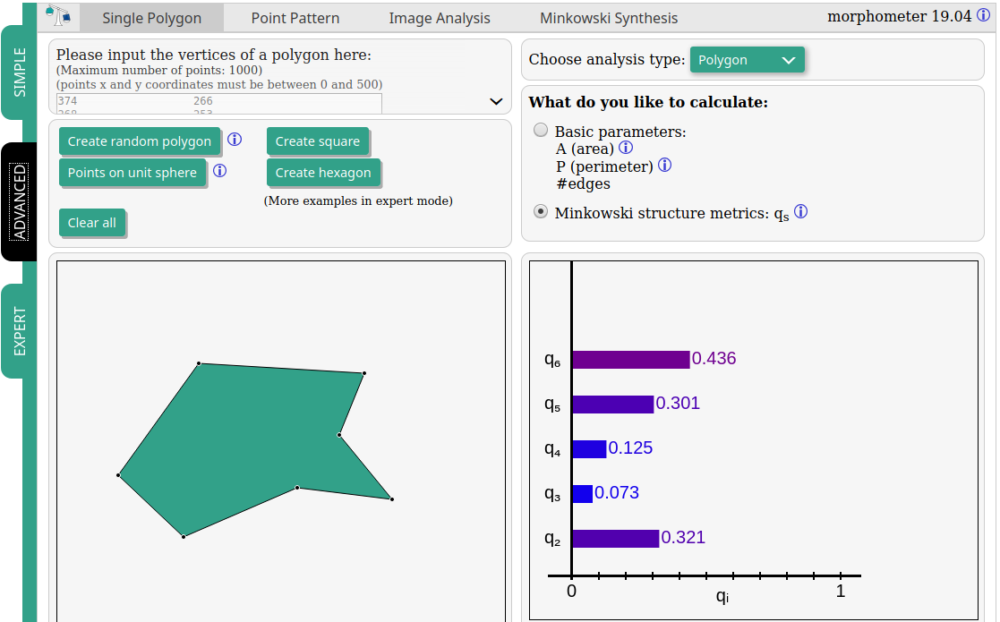
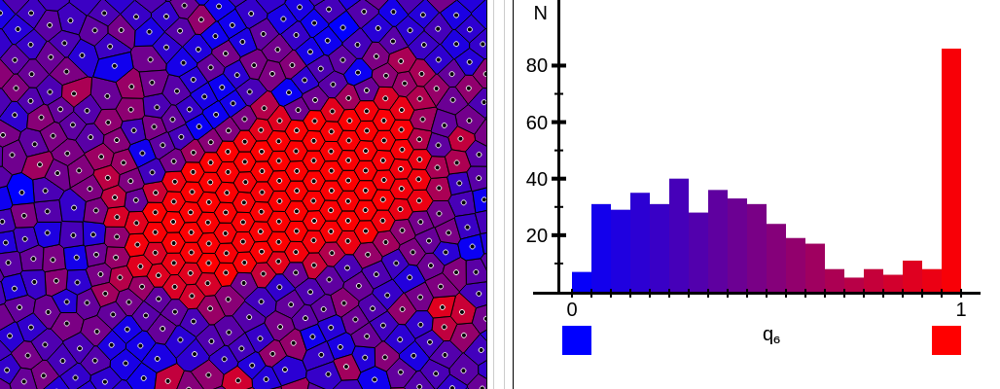
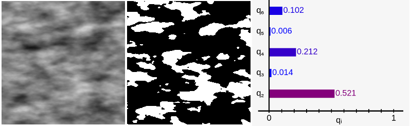

# Summary

A common challenge in scientific and technical domains is the quantitative
description of geometries and shapes, e.g. in the analysis of microscope
imagery or astronomical observation data.  Frequently, it is desirable to
go beyond scalar shape metrics such as porosity and surface to volume ratios
because the samples are anisotropic or because direction-dependent quantities
such as conductances or elasticity are of interest.  Popular analysis software
such as [ImageJ](https://imagej.nih.gov/ij/) and [SExtractor](https://imagej.nih.gov/ij/)
provide only limited tooling for higher-order anisotropy characterization;
usually only the tensor of inertia (rank 2) is available.

Minkowski Tensors are a systematic family of versatile and robust higher-order
shape descriptors, originating in integral geometry, see @bib:AdvMatReview for an introduction and detailed references.  They
allow for shape characterization of arbitrary order and promise a path to
systematic structure-function relationships for direction-dependent properties.
Minkowski Tensors have previously been applied to data as diverse as ice grain
microstructure [@bib:SchroederMicro2010],
granular packing geometries [@bib:BeadPacksAnisotropic2010; @bib:Schaller2015],
astronomical data [@bib:Kerscher2001; @bib:Joby2019; @bib:Klatt2020],
neuronal data [@bib:Beisbart2006],
foams [@bib:Saadatfar2012; @bib:Evans2017]
and random sets, tessellations and point patterns [@bib:AnisoFluids2010; @bib:Springer2017].
An accessible introduction to Minkowski Tensors can be found on
[www.morphometry.org](https://morphometry.org/theory/anisotropy-analysis-by-imt/).

Here, we present `papaya2`, a C++ library which facilitates computation of
irreducible Minkowski Tensors for two-dimensional geometries and shapes, including planar
objects bounded by polygonal contours, collections of points (point patterns)
and greyscale pixel data.
This library is accompanied by example programs and
bindings for Python, Matlab, and the JavaScript language.

`Papaya2` is a rewrite of [`papaya`](https://github.com/skapfer/papaya) with a
library interface, support for irreducible Minkowski Tensors and interpolated marching squares, and
extensions to Matlab, JavaScript and Python provided.  While the tensor of inertia is computed
by many tools, we are not aware of other open-source software which provides
higher-rank shape characterization in 2D.

For the analysis of the examples in this paper, we employ our interactive online resource
[Morphometer](https://morphometry.org/morphometer/) which uses `papaya2` for its computations.

# C++ library papaya2

The C++ 11 library `papaya2` contains the core algorithms to compute irreducible
Minkowski tensors of two-dimensional geometries.  It processes both polygonal
and 2D image input data.

`papaya2` is a header-only template library designed to operate on user data structures.
We bundle several example programs which can be adapted to user requirements,
or employed directly for simple analyses (see section *Demos*).

The main components of the library are defined in the header file `<papaya2.hpp>`.
Analysis results are returned in a `MinkowskiAccumulator` object, which offers
accessors to retrieve common morphometric data, including the following:

- `area()`  The 2D volume (area) enclosed by the geometry

- `perimeter()`  The perimeter (boundary length) of the geometry

- `msm(s)`  The $s$-th Minkowski structure metric $q_s$,
see [Morphometry page](https://morphometry.org/theory/anisotropy-analysis-by-imt/) and @bib:Mickel2013 for details

- `imt(s)`  The $s$-th irreducible Minkowski tensor $\Psi_s$,
see previous item for details

The library provides convenient wrapper functions which encapsulate common analysis tasks.
In general, these functions are C++ function templates which operate on user data structures.
User-supplied data structures need to include some required methods and operators as documented in the headers.
The most important entrypoints are

- `papaya2::imt_polygon`:
compute the irreducible Minkowski tensors of closed simple polygons, specified as a sequence
of vertices in counterclockwise order.

- `papaya2::imt_interpolated_marching_squares`:
computes the irreducible Minkowski Tensors of an excursion set of a single channel of a raster
graphics image (bitmap).  An extended version of the Marching Squares algorithm is
used which computes interpolated contours from 2x2 neighborhoods, see @bib:Mantz2008 for details.
The input data is passed to `papaya2` by reference via a suitable adapter class to avoid copies.
There are several examples of adapter classes provided, as well as a copying container (`BasicPhoto`).

- `papaya2::minkowski_map_interpolated_marching_squares`:
implements the Minkowski map algorithm [@bib:SchroederMicro2010] for a space-resolved anisotropy analysis.

The supplementary header `<papaya2/voronoi.hpp>` implements the Minkowski Tensor analysis of point
patterns via the Voronoi tessellation approach [@bib:AnisoFluids2010].  The demo
`ppanalysis` exemplifies how to use this header file.

# Application Examples

Here we show some examples analyzed in the [Morphometer web application](https://morphometry.org/morphometer/),
which uses `papaya2.js`, the JavaScript version of the `papaya2`.
Morphometer provides rapid analysis of small amounts of data (up to 1000 points, or 500x500 pixels).
For routine analysis we recommend using the `ppanalysis` and `imganalysis` demos or Python/Matlab bindings.

Minkowski Tensors can be applied to different types of data:

- Single polygons: $s$-fold symmetric polygons are characterized by high values of $q_s$.
\autoref{fig:morpho-ui} shows a polygon with approximates an equilateral triangle.
Therefore, we find high values of $q_3$, $q_6$, $q_9$, etc.
The distinguished directions of each $\Psi_s$ are depicted on the right of the $q_s$ bar diagram.

- Point patterns can be, for instance, realizations of abstract point processes or data of physical particle systems.
For the Minkowski Tensor analysis, a Voronoi tessellation of the points is constructed and
Minkowski Tensors of the individual Voronoi cells are computed.
\autoref{fig:morpho-pp-mode} (left) shows a hexagonal crystal cluster surrounded by an amorphous background.
The Minkowski structure metric $q_6$ (indicated by the color of the Voronoi cells) is very well suited to detect hexagonal crystalline structures.
The presence of ideal hexagonal cells is demonstrated by the peak at $q_6 = 1$ in the histogram on the right-hand side.

 
- Greyscale images can also be analyzed in terms of Minkowski Tensors.
\autoref{fig:morpho-image-mode} (left) shows a detail of an anisotropic Gaussian random field,
which is converted into a binary image by thresholding (center) and analyzed using Minkowski Tensors (right).
The significant $q_2$ value in the Minkowski analysis (right) shows that the random field has a preferred direction,
which is also reflected by the distinguished direction marker (red color).

# Demos and language bindings

In the directory `demos`, we provide a number of example programs which use the library
for data analysis.  These are meant to be modified and adapted to user needs as required.
For simple analyses, they can be used directly, see the 
[README file](https://github.com/morphometry/papaya2/blob/master/demos/README.md) in the `demos` folder.

We also provide bindings of the library for Python, Matlab and JavaScript.

# Acknowledgements

We acknowledge funding by Deutsche Forschungsgemeinschaft as part of the [Forschergruppe GPSRS](http://gpsrs.de).

We are grateful to Daniel Hug, Günther Last, Klaus Mecke and Gerd Schröder-Turk for guidance and support,
to Michael Klatt for many discussions and for his contributions to the scientific concept and content of the
Morphometer, to Dennis Müller and Thomas Schindler for example data, and to Simon Weis for technical advice.

We use [picopng](https://lodev.org/lodepng/) for loading PNG images,
[emscripten](https://emscripten.org/) for compiling to JavaScript,
[CGAL](https://cgal.org/) for Voronoi diagrams,
and
[Catch2](https://github.com/catchorg/Catch2) for unit tests.

# References
