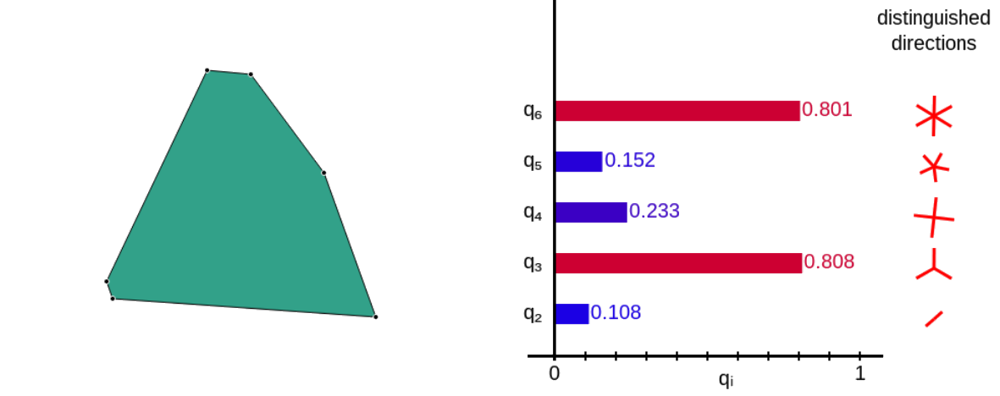
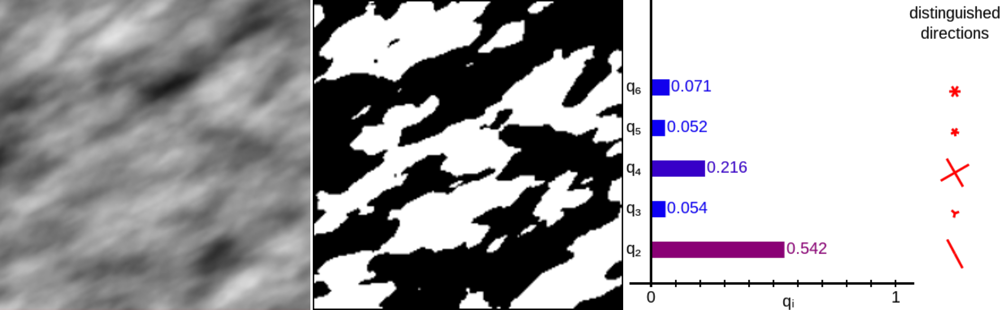

# Summary

A common challenge in scientific and technical domains is the quantitative
description of geometries and shapes, e.g. in the analysis of microscope
imagery or astronomical observation data.  Frequently, it is desirable to
go beyond scalar shape metrics such as porosity and surface to volume ratios
because the samples are anisotropic or because direction-dependent quantities
such as conductances or elasticity are of interest.  Popular analysis software
such as [ImageJ](https://imagej.nih.gov/ij/) and [SExtractor](https://imagej.nih.gov/ij/)
provide only limited tooling for higher-order anisotropy characterization;
usually only the tensor of inertia (rank 2) is available.

Minkowski Tensors are a systematic family of versatile and robust higher-order
shape descriptors, originating in integral geometry, see [@bib:AdvMatReview] for an introduction and detailed references.  They
allow for shape characterization to arbitrary order and promise a path to
systematic structure-function relationships for direction-dependent properties.
Minkowski Tensors have previously been applied to data as diverse as ice grain
microstructure [@bib:SchroederMicro2010],
granular packing geometries [@bib:BeadPacksAnisotropic2010; @bib:Schaller2015],
astronomical data [@bib:Kerscher2001; @bib:Joby2019; @bib:Klatt2020],
neuronal data [@bib:Beisbart2006],
foams [@bib:Saadatfar2012; @bib:Evans2017]
and random sets, tessellations and point patterns [@bib:AnisoFluids2010; @bib:Springer2017].
An accessible introduction to Minkowski Tensors can be found on
[www.morphometry.org](https://morphometry.org/theory/anisotropy-analysis-by-imt/).

Here, we present `papaya2`, a C++ library which facilitates computation of
irreducible Minkowski Tensors for two-dimensional geometries and shapes, including planar
objects bounded by polygonal contours, collections of points (point patterns)
and greyscale pixel data.

This library is accompanied by example programs and
bindings for Matlab and the Python language.
We also present the [Morphometer](https://morphometry.org/morphometer/), an
interactive online resource for analyzing two-dimensional structures.

`Papaya2` is a rewrite of [`papaya`](https://github.com/skapfer/papaya) with a
library interface, support for irreducible Minkowski Tensors and interpolated marching squares, and
extensions to Matlab and Python provided.  While the tensor of inertia is computed
by many tools, we are not aware of other open-source software which provides
higher-rank shape characterization in 2D.

# C++ library papaya2

The C++ 11 library `papaya2` contains the core algorithms to compute irreducible
Minkowski tensors of two-dimensional geometries.  It processes both polygonal
and 2D image input data.

`papaya2` is a header-only template library designed to operate on user data structures.
We bundle several example programs which can be adapted to user requirements,
or employed directly for simple analyses (see section *Command-line tools*).

The main components of the library are defined in the header file `papaya2/papaya2.hpp`.
Analysis results are returned in a `MinkowskiAccumulator` object, which offers
accessors to retrieve common morphometric data, including the following:

- `area()`  The 2D volume (area) enclosed by the geometry

- `perimeter()`  The perimeter (boundary length) of the geometry

- `msm(s)`  The $s$-th Minkowski structure metric $q_s$,
see [Morphometry page](https://morphometry.org/theory/anisotropy-analysis-by-imt/) and [@bib:Mickel2013] for details

- `imt(s)`  The $s$-th irreducible Minkowski tensor $\Psi_s$,
see [Morphometry page](https://morphometry.org/theory/anisotropy-analysis-by-imt/) for details

The library provides convenient wrapper functions which encapsulate common analysis tasks.
In general, these functions are C++ function templates which operate on user data structures.
User-supplied data structures need to include some required methods and operators as documented in the headers.
The most important entrypoints are

- `papaya2::imt_polygon`:
compute the irreducible Minkowski tensors of closed convex polygons, specified as a sequence
of vertices in counterclockwise order.

- `papaya2::imt_interpolated_marching_squares`:
computes the irreducible Minkowski tensors of an excursion set of a single channel of a raster
graphics image (bitmap).  An extended version of the classic Marching Squares algorithm is
used which computes interpolated contours from 2x2 neighborhoods, see [@bib:Mantz2008] for details.
The input data is passed to `papaya2` by reference via a suitable adapter class to avoid copies.
There are several examples of adapter classes provided, as well as a copying container (`BasicPhoto`).

- `papaya2::minkowski_map_interpolated_marching_squares`:
implements the Minkowski map algorithm [@bib:SchroederMicro2010] for a space-resolved anisotropy analysis.

The supplementary header `<papaya2/voronoi.hpp>` implements the Minkowski Tensor analysis of point
patterns via the Voronoi tessellation approach [@bib:AnisoFluids2010].  The command-line tool
`ppanalysis` exemplifies how to use this header file.  For computing the Voronoi diagram,
the [CGAL](https://cgal.org/) library is required.

# Application: Morphometer

We use the `papaya2` library in our interactive analysis tool [Morphometer](https://morphometry.org/morphometer/).
It provides rapid analysis of small amounts of data (up to 500 points, or 500x500 pixels).
For routine analysis we recommend using the command-line tools or Python/Matlab bindings.

Morphometer provides several advanced analysis modes:

- Single polygon mode: \autoref{fig:morpho-ui} shows the user interface of Morphometer when analyzing a single polygon (left-hand side).
On the right-hand side, the Minkowski structure metrics of the polygon are displayed.

- Point pattern analysis mode can be used to analyze abstract point patterns and data of physical particle systems.
For the analysis, a Voronoi tessellation of the points is constructed and Minkowski Tensors of the individual
Voronoi cells are computed.  Morphometer provides histograms and basic statistics of the morphometric data,
see \autoref{fig:morpho-pp-mode}.

- Image analysis mode can be used to analyze single-channel (e.g. greyscale) pixel data.
User-provided images are segmented using
the Marching Squares algorithm, and a morphometric analysis using Minkowski Tensors is performed for either
the complete image or a region of interest, see \autoref{fig:morpho-image-mode}.

# Command-line tools and bindings

Bundled with the C++ library, we provide a number of example programs which use the library
for data analysis.  These are meant to be modified and adapted to user needs as required.
For simple analyses, they can be used directly, see the
[documentation](https://morphometry.org/software/papaya2/).
The example programs can be built by typing `make`.

We also provide bindings of the library for Matlab and Python.
For Matlab, example scripts are contained in `ppanalysis.m` and `imganalysis.m` in the `matlab`
directory.
The Python module can be built by typing `make pypaya2`.  It currently has support for the
point pattern analysis only.

# Acknowledgements

We acknowledge funding by Deutsche Forschungsgemeinschaft as part of the [Forschergruppe GPSRS](http://gpsrs.de).

We are grateful to Daniel Hug, Günther Last, Klaus Mecke and Gerd Schröder-Turk for guidance and support,
to Michael Klatt for many discussions and suggestions, and to Simon Weis for technical advice.

We use [picopng](https://lodev.org/lodepng/) for loading PNG images,
[emscripten](https://emscripten.org/) for compiling to JavaScript,
[CGAL](https://cgal.org/) and [d3-voronoi](https://github.com/d3/d3-voronoi) for Voronoi diagrams,
and
[Catch2](https://github.com/catchorg/Catch2) for unit tests.

# References
